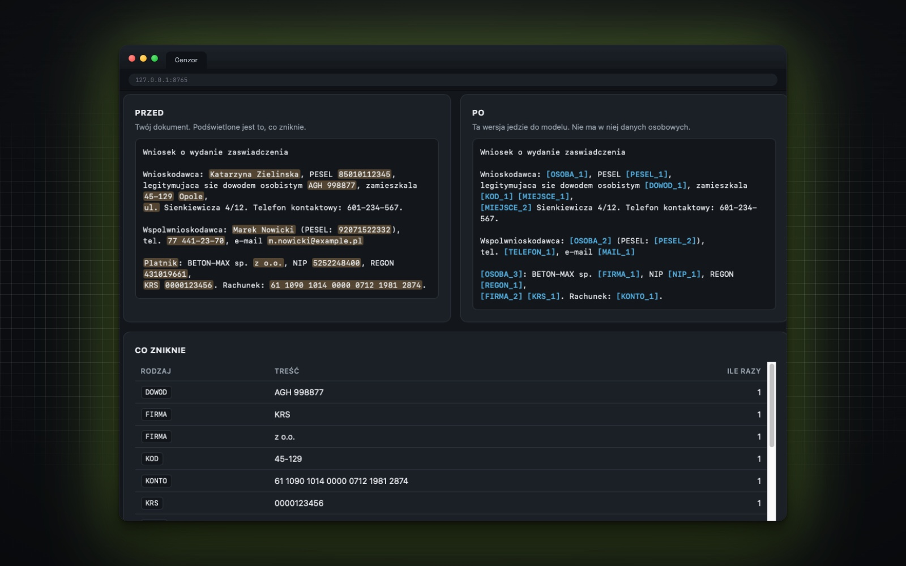

# Cenzor

[](https://github.com/studiogo/cenzor/actions/workflows/testy.yml)
[](LICENSE)
[](https://www.python.org/downloads/)
[](https://github.com/studiogo/cenzor/releases)
[](pomiar/WYNIKI.md)

Wycina dane osobowe z dokumentu, zanim wyślesz go do ChatGPT, Claude albo innego
modelu. Działa w całości na Twoim komputerze — żaden plik nie wychodzi do sieci.

Po powrocie odpowiedzi wstawia prawdziwe nazwiska z powrotem, więc pracujesz
normalnie, a model nigdy nie widzi danych Twoich klientów.

```
"Umowa z Janem Kowalskim, PESEL 85010112345"
        ↓
"Umowa z [OSOBA_1], PESEL [PESEL_1]"     ← to wysyłasz do modelu
[OSOBA_1] = Jan Kowalski                  ← to zostaje na Twoim dysku
        ↓
"Jan Kowalski ma zapłacić do 15 marca"    ← odpowiedź po podmianie z powrotem
```

## Dla kogo

Dla każdego, kto ma w dokumentach cudze dane i chce korzystać z AI, nie łamiąc RODO:
księgowość, kancelarie, dział kadr, biura rachunkowe, agencje. Nie musisz umieć
programować — jest okno w przeglądarce, do którego przeciągasz plik myszką.

## Instalacja

Potrzebujesz Pythona 3.10 lub nowszego. Reszta instaluje się sama.

**Mac i Linux** — w terminalu:

```bash
git clone https://github.com/studiogo/cenzor.git
cd cenzor
./instaluj.sh
venv/bin/python okno/serwer.py
```

**Windows** — w PowerShellu (Start → wpisz „PowerShell"):

```powershell
git clone https://github.com/studiogo/cenzor.git
cd cenzor
powershell -ExecutionPolicy Bypass -File .\instaluj.ps1
venv\Scripts\python okno\serwer.py
```

Trzecia linijka pobiera model języka polskiego (574 MB), więc chwilę to trwa.
Ostatnia otwiera okno narzędzia w przeglądarce — o nim niżej.

### Windows: dwie rzeczy, które potrafią stanąć na drodze

**Nie masz gita.** Pierwsza linijka wtedy nie zadziała. Wejdź na
[stronę repozytorium](https://github.com/studiogo/cenzor), kliknij zielony przycisk
„Code", wybierz „Download ZIP" i rozpakuj pobrany plik — powstanie katalog
`cenzor-main`. Otwórz go w Eksploratorze plików, kliknij pasek adresu u góry,
wpisz `powershell` i naciśnij Enter. PowerShell otworzy się już w tym katalogu,
więc dwie pierwsze linijki pomijasz i zaczynasz od trzeciej.

**Wpisujesz `python`, a otwiera się Sklep Windows.** To znaczy, że Pythona nie ma
— Windows podstawia pod tę nazwę skrót do sklepu. Pobierz Pythona z
[python.org](https://www.python.org/downloads/), przy instalacji zaznacz
„Add python.exe to PATH", zamknij PowerShell, otwórz go na nowo i uruchom
instalator jeszcze raz. Wersji ze sklepu nie instaluj. Sam instalator sprawdza
kandydatów na Pythona, uruchamiając każdego z nich, więc skrót do sklepu odrzuca
i szuka dalej — zaczyna od uruchamiacza `py`, który python.org dokłada zawsze.

## Pierwsze uruchomienie



Ostatnia linijka z instalacji otwiera okno w przeglądarce — przeciągasz plik,
widzisz, co zniknie, pobierasz wynik. Kolejne razy uruchamiasz je tak samo:

```bash
venv/bin/python okno/serwer.py                # Mac i Linux
```

```powershell
venv\Scripts\python okno\serwer.py            # Windows
```

Otworzy się `http://127.0.0.1:8765`. Serwer słucha wyłącznie na Twoim komputerze
i nie da się go wystawić na sieć — to nie niedoróbka, tylko sedno narzędzia.

Wiersz poleceń, jeśli wolisz:

```bash
venv/bin/python bin/anonimizuj.py umowa.pdf --jezyk pl --podglad   # co zniknie
venv/bin/python bin/anonimizuj.py umowa.pdf --jezyk pl             # wytnij
venv/bin/python bin/odwroc.py odpowiedz.txt umowa-anon-slownik.json
```

Na Windowsie te same polecenia, tylko Python leży gdzie indziej:

```powershell
venv\Scripts\python bin\anonimizuj.py umowa.pdf --jezyk pl --podglad
venv\Scripts\python bin\anonimizuj.py umowa.pdf --jezyk pl
venv\Scripts\python bin\odwroc.py odpowiedz.txt umowa-anon-slownik.json
```

## Co rozpoznaje

**Sam się potwierdza cyfrą kontrolną** — PESEL, NIP, REGON, numer dowodu
osobistego, paszport, numer księgi wieczystej, numer prawa wykonywania zawodu
lekarza, IMEI telefonu. Tu nie ma zgadywania: numer, który nie przechodzi
sprawdzenia, nie jest wycinany.

**Rozpoznawany po kształcie** — KRS, kod pocztowy, numer rejestracyjny pojazdu,
numer konta, adres e-mail, adres sieciowy, klucze do systemów, numer recepty,
identyfikator działki ewidencyjnej.

**Wycinany tylko przy słowie obok** — VIN (przy „VIN" albo „nr nadwozia"),
prawo jazdy, numer producenta rolnego, numer BDO, karta pobytu, telefon (przy
„tel", „fax", „kom" albo z przedrostkiem +48). Bez tego warunku każda kwota
w sprawozdaniu budżetowym wyglądałaby jak numer telefonu — sprawdziliśmy to
pomiarem i tak właśnie było.

Nazwiska, nazwy firm, instytucji i miejscowości — modelem języka polskiego,
który rozpoznaje je po tym, jak stoją w zdaniu, także w odmianie.

Przyjmuje PDF, Word (.docx), OpenDocument (.odt) i zwykły tekst. Format rozpoznaje
po zawartości, nie po rozszerzeniu.

## Ile z tego działa

Zmierzone na **324 057 słowach** polskich pism urzędowych z Biuletynów Informacji
Publicznej, w dwóch osobnych zestawach. Drugi zestaw zebraliśmy **po** zakończeniu
prac, więc narzędzie nie widziało tych dokumentów, gdy powstawały jego reguły.

| co | wynik |
|---|---|
| PESEL, NIP, REGON, konto, telefon, kod pocztowy | 100% |
| pełne nazwiska na dokumentach niewidzianych | 98,9% |
| odwracalność (tekst odtworzony co do znaku) | 20 na 20 dokumentów |

Przez oba zestawy przeszło jedno prawdziwe nazwisko na 287.

Sprawdziliśmy to jeszcze raz na cudzym materiale, żeby nikt nie zarzucił nam
mierzenia własną miarką: **98,1% pełnych nazwisk** na części testowej korpusu
KPWr Politechniki Wrocławskiej, gdzie nazwiska oznaczyli ludzie, a nie maszyna
(blogi i teksty prasowe, 75 696 słów, licencja CC BY 3.0).

Numery sprawdzamy osobno, bo prawdziwych PESEL-i nikt nie publikuje: budujemy je
z policzoną cyfrą kontrolną i wkładamy w zdania z pism. **Wykrywanych 23 na 23
rodzaje**, a na 323 tysiącach słów pism urzędowych, w których takich numerów nie
ma, jeden fałszywy alarm.

Liczymy pełne nazwiska, czyli „imię plus nazwisko". Jest jeszcze miara szersza —
wszystko, co model języka uzna za osobę — i tam wychodzi 91,6% oraz 84,2%.
Ta miara bierze za osobę także nazwy ulic („Krasińskiego"), przymiotniki od
powiatów („Pułtuskiego") i wyrazy urwane przez łamanie wierszy w PDF
(„Departamen"). To nie są dane osobowe, więc im więcej takiego szumu
w dokumencie, tym niżej ta liczba spada — i tym mniej mówi.

Pomiar możesz powtórzyć u siebie — [pomiar/WYNIKI.md](pomiar/WYNIKI.md) opisuje
sposób liczenia, a `pomiar/pobierz.py` ściąga te same dokumenty z BIP-ów.
Dokumentów nie ma w repozytorium: są w nich nazwiska prawdziwych ludzi.

## Sprawdź, czy nic nie jest zepsute

```bash
venv/bin/python -m pytest test/ -q            # Mac i Linux
```

```powershell
venv\Scripts\python -m pytest test/ -q        # Windows
```

33 sprawdzenia: czy sumy kontrolne odsiewają podrobione numery, czy każdy rodzaj
numeru znika ze zdania, czy kwota i data **zostają** nietknięte, i czy z pliku
z kluczem da się odtworzyć oryginał co do znaku. Te same testy uruchamiają się
same przy każdej zmianie w repozytorium, na Linuksie i na Windowsie — na Windowsie
razem z instalatorem i próbą wycięcia na przykładzie.

## Jak wypadamy na tle innego polskiego narzędzia

Polskich narzędzi do tego samego jest kilka. Najdalej zaszedł
[Parawan](https://github.com/karolpolikarp/parawan) i pod jednym względem bije nas
na głowę: to jeden plik HTML, który otwierasz podwójnym kliknięciem. Bez instalacji,
bez Pythona, bez modelu do pobrania — działa nawet na komputerze z firmowymi
blokadami. Nasze narzędzie wymaga instalacji i pół gigabajta modelu języka.

Przepuściliśmy oba przez te same 19 dokumentów i zmierzyliśmy tym samym przyrządem
(4 września 2026, Parawan w wersji z wydań z tego dnia):

| co mierzymy | Cenzor | Parawan |
|---|---|---|
| pełne nazwiska, 286 sztuk | 99,0% wyciętych | 82,5% wyciętych |
| wszystko, co model języka uznał za osobę, 556 | 86,3% | 48,7% |
| kod pocztowy | 100% | 100% |
| PESEL (jeden w zestawie) | wycięty | został |

Różnica bierze się z metody. Parawan rozpoznaje dane wzorcami i listami — dlatego
mieści się w jednym pliku. My używamy modelu języka polskiego, więc łapiemy nazwisko
w odmianie i takie, którego nie ma na żadnej liście. Na numerach o ustalonej budowie
idziemy równo.

Powtórz ten pomiar sam: `pomiar/pobierz.py` ściąga dokumenty, `pomiar/kontrola.py`
liczy. Sposób liczenia opisuje [pomiar/WYNIKI.md](pomiar/WYNIKI.md).

## Czego to nie załatwia

**Nie chroni przed rozpoznaniem po treści.** Wycięcie nazwisk nie znaczy, że nikt
nie ustali, o kogo chodzi. W protokole sesji rady gminy nazwa gminy padła 56 razy;
po oczyszczeniu została dwa razy — a jedno wystarczy, żeby „Wójt [OSOBA_4]" miał
tylko jedną możliwą wartość. Sprawdzaj wynik przed wysłaniem.

**Skany są bezużyteczne.** PDF będący zdjęciem strony nie ma w sobie tekstu.
Program powie to wprost, zamiast udawać, że zadziałał.

**Danych pacjentów nie anonimizuj.** Rejestrów medycznych po prostu nie wyjmuj
z systemu klienta.

**Plik z kluczem to cały oryginał.** Razem z plikiem oczyszczonym odtwarza
dokument w całości. Trzymaj go tam, gdzie trzymasz sam dokument, i nie wysyłaj nigdzie.

## Jak to działa w środku

Sześć warstw, dwa niezależne wykrywacze i bramka, która rozstrzyga ich spory:
[JAK-TO-DZIALA.md](JAK-TO-DZIALA.md).

## Użycie z Claude Code

Repozytorium jest jednocześnie wtyczką. Skopiuj katalog do `~/.claude/skills/`
(na Windowsie: `%USERPROFILE%\.claude\skills\`) i powiedz agentowi „zanonimizuj
ten plik".

## Licencja

MIT — rób z tym, co chcesz.
